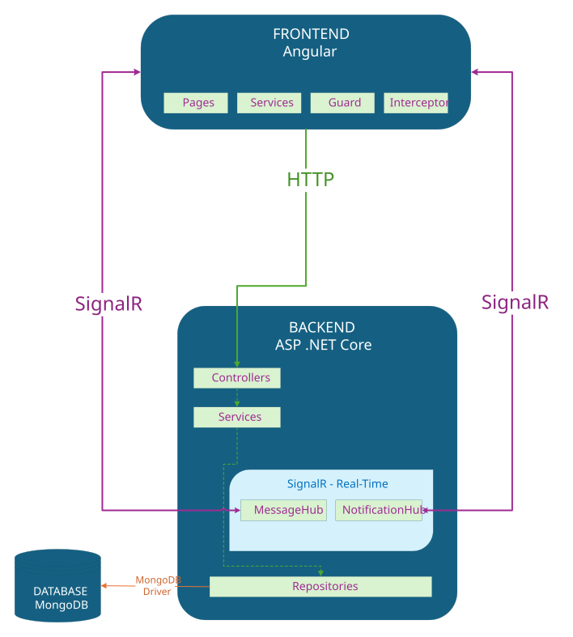
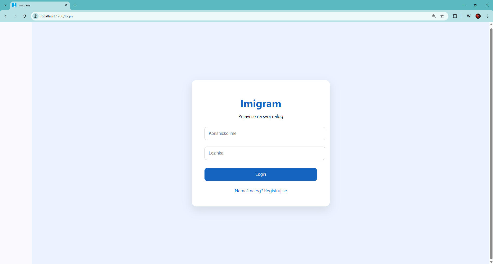
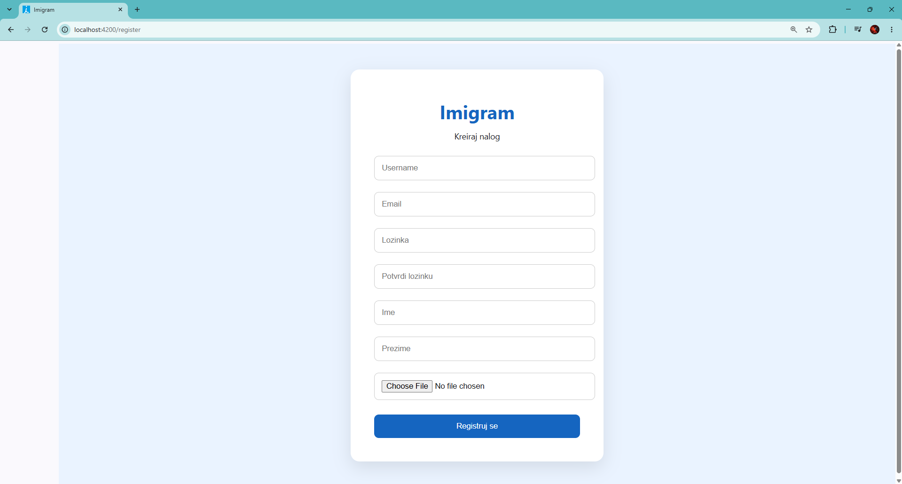
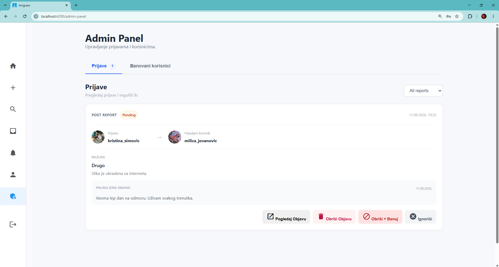
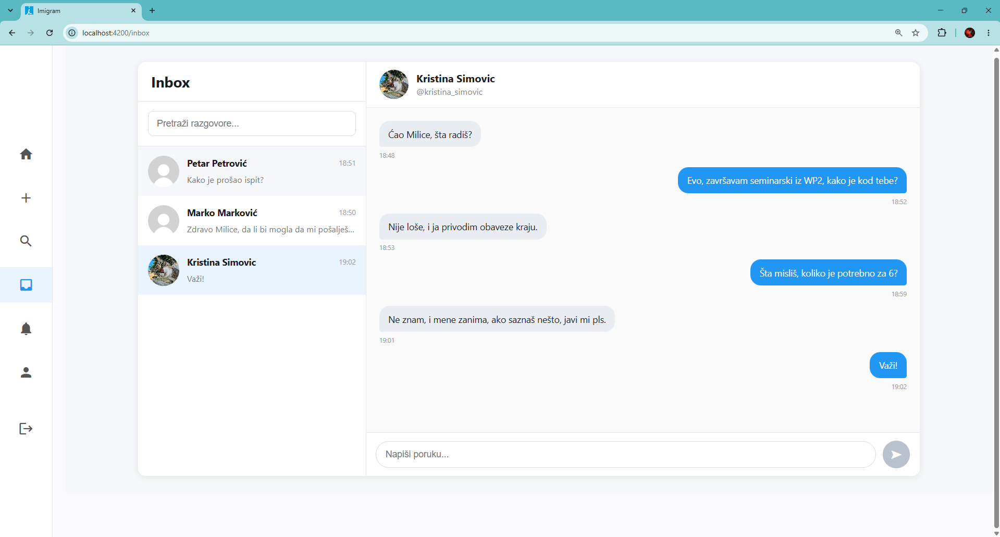
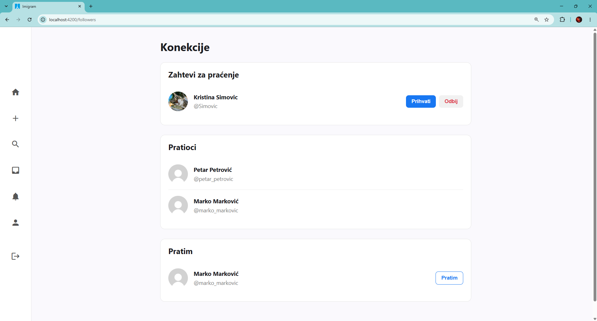
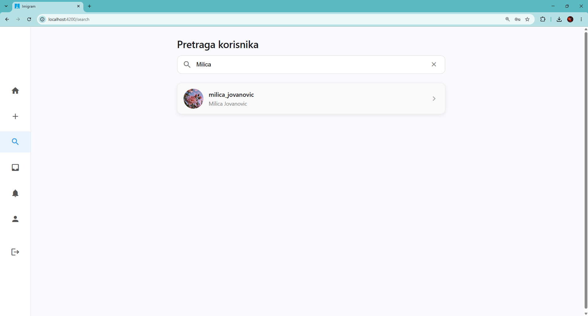
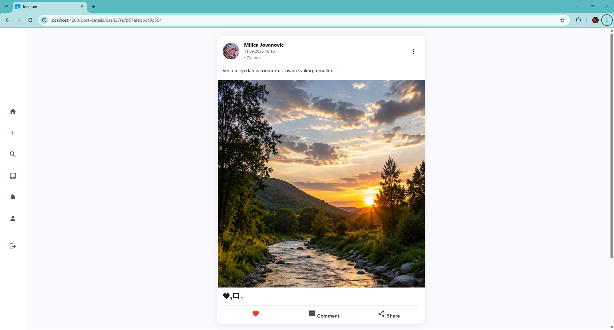

# imigram
[](https://dotnet.microsoft.com/)
[](https://learn.microsoft.com/dotnet/csharp/)
[](https://angular.dev/)
[](https://www.mongodb.com/)
[](https://dotnet.microsoft.com/apps/aspnet/signalr)

Seminarski rad iz predmeta Web Programiranje 2

## Sadržaj

- [Opis Projekta](#opis-projekta)
- [Tehnologije](#tehnologije)
- [Arhitektura](#arhitektura)
- [Struktura Projekta](#struktura-projekta)
- [Pokretanje](#pokretanje)
  - [Unapred potrebno](#unapred-potrebno)
  - [Kloniranje repozitorijuma](#kloniranje-repozitorijuma)
  - [Konfiguracija](#konfiguracija)
  - [Pokretanje backenda](#pokretanje-backenda)
  - [Pokretanje frontenda](#pokretanje-frontenda)
  - [Dostupnost aplikacije](#dostupnost-aplikacije)
- [API Dokumentacija](#api-dokumentacija)
- [Autentifikacija i autorizacija](#autentifikacija-i-autorizacija)
- [Real-time komunikacija](#real-time-komunikacija)
- [Izgled aplikacije](#izgled-aplikacije)
- [Testiranje](#testiranje)
## Opis projekta

Web aplikacija koja predstavlja društvenu mrežu i omogućava korisnicima da se povezuju, dele objave i komuniciraju sa drugim korisnicima.

Funkcionalnosti:
- Login/Registracija
- Kreiranja objava
- Prikaz objava
- Pretraga profila drugih korisnika
- Praćenje drugih korisnika
- Slanje poruka
- Obaveštenja
- Lajkovanje, komentarisanje objava
- Admin interfejs

## Tehnologije

- **Backend:** ASP .NET Core
- **Frontend:** Angular
- **Baza podataka:** MongoDB
- **Real-time obaveštenja i poruke:** SignalR
- **Autentifikacija:** JWT

## Arhitektura



## Struktura projekta

```text
Imigram/
├── backend/
│   └── ImigramAPI/
│       ├── Controllers/
│       ├── Database/
│       ├── DTOs/
│       ├── Hubs/
│       ├── Interfaces/
│       ├── Models/
│       ├── Properties/
│       ├── Repositories/
│       │   └── Interfaces/
│       ├── Services/
│       │   └── Interfaces/
│       └── wwwroot/
│           ├── images/
│           │   └── users/
│           └── uploads/
│
├── frontend/
│   ├── public/
│   │   └── sounds/
│   └── src/
│       ├── app/
│       │   ├── core/
│       │   │   ├── guards/
│       │   │   ├── interceptors/
│       │   │   └── services/
│       │   │
│       │   ├── features/
│       │   │   ├── auth/
│       │   │   │   ├── login/
│       │   │   │   └── register/
│       │   │   ├── models/
│       │   │   ├── pages/
│       │   │   │   ├── admin-panel/
│       │   │   │   ├── create-post/
│       │   │   │   ├── followers-page/
│       │   │   │   ├── home/
│       │   │   │   ├── inbox-page/
│       │   │   │   ├── post-details/
│       │   │   │   └── profile/
│       │   │   └── shared/
│       │   │
│       │   └── shared/
│       │       ├── navbar/
│       │       ├── post-card/
│       │       ├── toast-action/
│       │       └── toast-notification/
│       │
│       └── assets/
│
└── README.md
```

## Pokretanje

### Unapred potrebno:

- .NET Core 10.0
- Angular 22.0.8
- MongoDB

### Kloniranje repozitorijuma

```bash
  git clone https://github.com/Marko1401M/imigram.git
 ```

### Konfiguracija:

Pre pokretanja backend-a neophodno je podesiti `appsetting.json` fajl sa odgovarajućim MongoDB konekcionim stringom i JWT podešavanjima
```json
{
  "Jwt": {
    "Key": "UNESITE_VAŠ_KLJUČ",
    "Issuer": "ImigramAPI",
    "Audience": "ImigramClient",
    "ExpireMinutes": 120
  },
  "MongoDb": {
    "ConnectionString": "UNESITE_VAŠ_KONEKCIONI_STRING",
    "Database": "ImigramDB"
  },
  "Logging": {
    "LogLevel": {
      "Default": "Information",
      "Microsoft.AspNetCore": "Warning"
    }
  },
  "AllowedHosts": "*"
}
```

### Pokretanje backenda:
```shell
cd imigram/backend/ImigramAPI
dotnet restore
dotnet run
```

### Pokretanje frontenda:
```shell
cd imigram/frontend
npm install
ng serve
```

### Dostupnost aplikacije

Backend će raditi na: 
- https://localhost:7109
- http://localhost:5233 
 

Frontend će raditi na:
- http://localhost:4200/

## API Dokumentacija
Backend api je implementiran korišćenjem ASP .NET Core Web API-ja.

API koristi JWT auth za zaštićene endpoint-e.

Detaljnija dokumentacija dostupna je na: `https://localhost:7109/swagger/index.html`

### Authentication
| Method | Endpoint | Opis | Auth |
|--------|----------|------|------|
| POST   | `api/Auth/register`| Registracija korisnika | Ne |
| POST   | `api/Auth/login`   | Prijava korisnika | Ne |

### Users
| Method | Endpoint | Opis | Auth |
|--------|----------|------|------|
| GET   | `api/User/{userId}`| Dohvatanje korisnika po ID | Da |
| GET   | `api/User/search`| Pretraga korisnika po query-u | Da |
| PUT   | `api/User/update/profile-image`| Ažuriranje profile slike korisnika | Da |

### Posts
| Method | Endpoint | Opis | Auth |
|--------|----------|------|------|
| POST   | `api/Post`| Kreiranje nove objave | Da |
| GET   | `api/Post`| Dohvatanje svih objava | Da |
| GET   | `api/Post/{id}`| Dohvatanje objave po ID | Da |
| GET   | `api/Post/all/{userId}`| Dohvatanje svih objava jednog korisnika po ID korisnika | Da |
| GET   | `api/Post/feed`| Dohvatanje svih objava za feed korisnika | Da |
| DELETE   | `api/Post/{postId}`| Brisanje objave po ID | Da |

### Follow
| Method | Endpoint | Opis | Auth |
|--------|----------|------|------|
| POST   | `api/Follow/send_request`| Slanje zahteva za praćenje | Da |
| POST   | `api/Follow/accept_request/{requestId}`| Prihvatanje zahteva za pracenje | Da |
| POST   | `api/Follow/decline_request/{requestId}`| Odbijanje zahteva za pracenje | Da |
| GET   | `api/Follow/followings/{userId}`| Dohvatanje svih korisnika koje korisnik `userId` prati | Da |
| GET   | `api/Follow/followers/{userId}`| Dohvatanje svih pratilaca korisnika `userId` | Da |
| GET   | `api/Follow/follow_request`| Dohvatanje svih zahteva za praćenje prijavljenog korisnika | Da |
| POST   | `api/Follow/follow_status/{userId}`| Dohvatanje statusa pracenja izmedju prijavljenog korisnika i korisnika `userId` | Da |


### Admin
| Method | Endpoint | Opis | Auth |
|--------|----------|------|------|
| POST   | `api/Admin/ban/{userId}`| Banovanje korisnika `userId` | Da |
| POST   | `api/Admin/unban/{userId}`| Uklanjanje ban-a korisnika `userId` | Da |
| GET   | `api/Admin/`| Dohvatanje svih banovanih korisnika | Da |
| DELETE   | `api/Admin/{postId}`| Brisanje objave `postId` | Da |

### Chat
| Method | Endpoint | Opis | Auth |
|--------|----------|------|------|
| GET   | `api/Chat`| Dohvatanje svih chat-ova prijavljenog korisnika | Da |
| GET   | `api/Chat/{chatId}`| Dohvatanje chat-a `chatId` | Da |
| GET   | `api/Chat/with/{userId}`| Dohvatanje chat-a izmedju prijavljenog korisnika i korisnika `userId` | Da |

### Comment
| Method | Endpoint | Opis | Auth |
|--------|----------|------|------|
| POST   | `api/Comment`| Kreiranje novog komentara | Da |
| GET   | `api/Comment/{commentId}`| Dohvatanje komentara `commentId` | Da |
| GET   | `api/Comment/all/{postId}`| Dohvatanje svih komentara na objavi `postId` | Da |

### Like
| Method | Endpoint | Opis | Auth |
|--------|----------|------|------|
| POST   | `api/Like`| Kreiranje novog like-a | Da |
| GET   | `api/Like/{postId}`| Dohvatanje svih like-ova za objavu `postId`| Da |
| GET   | `api/Like/check-like/{postId}`| Provera da li je prijavljen korisnik like-ova objavu `postId` | Da |
| DELETE   | `api/Like/{postId}`| Brisanje like-a prijavljenog korisnika na objavi `postId` | Da |

### Message 
| Method | Endpoint | Opis | Auth |
|--------|----------|------|------|
| GET   | `api/Message/{chatId}`| Dohvatanje svih poruka iz chat-a `chatId` | Da |
| PUT   | `api/Message/{messageId}/read`| Obelezavanje poruke `messageId` kao procitane | Da |

### Notification
| Method | Endpoint | Opis | Auth |
|--------|----------|------|------|
| POST   | `api/Notification/read/{notificationId}`| Obelezavanje obavestenja `notificationId` kao procitano | Da |
| GET   | `api/Notification`| Dohvatanje svih obavestenja iz za prijavljenog korisnika | Da |


### Report
| Method | Endpoint | Opis | Auth |
|--------|----------|------|------|
| POST   | `api/Report`| Kreiranje prijave za objavu | Da |
| POST   | `api/Report/get/all`| Dohvatanje svih prijava | Da |
| GET   | `api/Report/get/all/{status}`| Dohvatanje svih prijava za objavu po statusu `status` | Da |
| GET   | `api/Report/{id}`| Dohvatanje prijave `id` | Da |

## Autentifikacija i autorizacija
Za autentifikaciju korisnika koristi se JWT (JSON Web Token).

Nakon uspešne prijave (login-a), server generiše JWT token koji frontend čuva u `localStorage` memoriji.

Prilikom slanja zahteva ka zaštićenim endpoint-ima, JWT token se automatski dodaje u `Authorization` header HTTP zahteva pomoću Angular HTTP interceptora.


## Real-time komunikacija

Real-time komunikacija je realizovana korišćenjem SignalR.

Obuhvata:
- Slanje i prijem poruka.
- Prijem i prikaz obaveštenja.

## Izgled aplikacije

### Login stranica


### Register stranica


### Admin Panel


### Inbox 


### Pratioci


### Pretraga


### Objava


## Testiranje

Testiranje je odradjeno u seleniumu. Nisam stigao da testiram baš sve funkcionalnosti, već samo one glavne. Ostale funkcionalnosti su testirane ručno i rade.

### Testovi
| Tip  | Naziv     | Opis |
|--------|----------|---------|
|Register| `ValidRegistration`| Registracija korisnika sa validnim kredencijalima  |
|Register| `InvalidUsernameRegistration`| Registracija korisnika sa nedozvoljenim korisničkim imenom|
|Register| `InvalidEmailRegistration`| Registracija korisnika sa nedozvoljenom email adresom|
|Register| `PasswordDontMatchRegistration`| Registracija korisnika sa nepodudarajućim šiframa|
|Register| `UsernameTakenRegistration`| Registracija korisnika sa zauzetim korisničkim imenom|
|Register| `EmailTakenRegistration`| Registracija korisnika sa zauzetom email adresom|
|Login| `LoginWithValidCredentials`| Prijava korisnika sa validnim kredencijalima  |
|Login| `LoginWithInvalidUsername`| Prijava korisnika sa nepostojećim korisničkim imenom  |
|Login| `LoginWithInvalidPassword`| Prijava korisnika sa pogrešnom šifrom  |
|Login| `LoginWithInvalidUsernameAndPassword`| Prijava korisnika sa pogrešnim korisničkim imenom i pogrešnom šifrom  |
|Search| `ValidSearch`| Pretraga korisnika po korisničkom imenu i običnom imenu |
|CreatePost| `CreatePost`| Kreiranje nove objave |
|PostDetails| `LikePost`| Lajkovanje objave |
|PostDetails| `CommentPost`| Komentarisanje objave |
